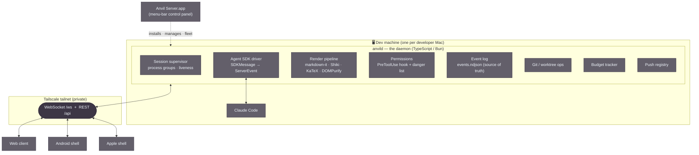
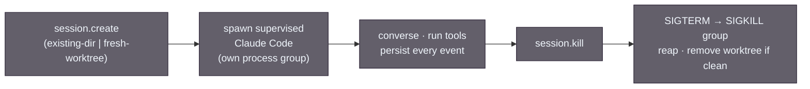
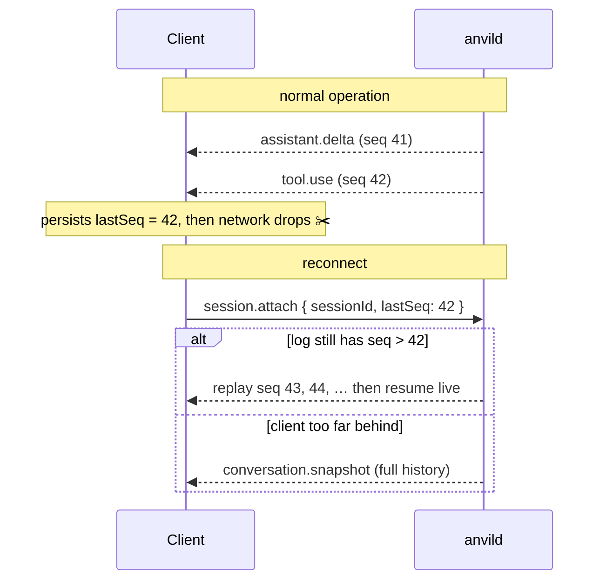
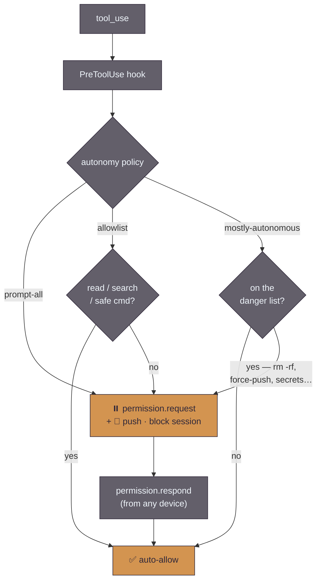
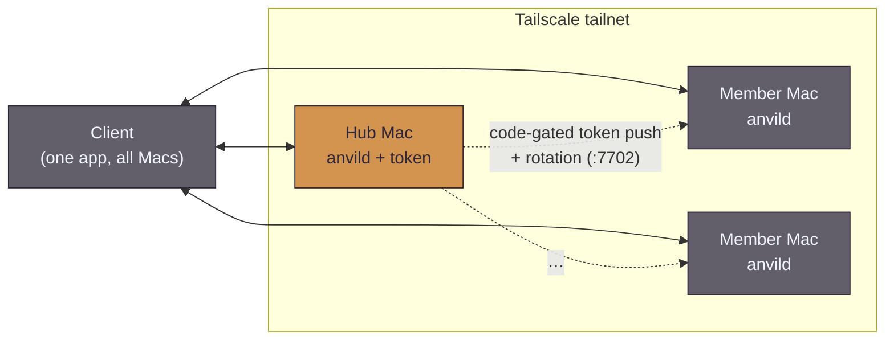

  <picture>
    <source media="(prefers-color-scheme: dark)" srcset="assets/anvil-banner-dark.svg">
    <source media="(prefers-color-scheme: light)" srcset="assets/anvil-banner-light.svg">
    
  </picture>

# Architecture

This is the approachable tour. It explains the moving parts and how they fit together,
with diagrams. For the authoritative, decision-by-decision design see
[`plans/anvil-native-architecture.md`](plans/anvil-native-architecture.md); for the exact
wire format see [`plans/anvil-protocol.ts`](plans/anvil-protocol.ts).

---

## The one big idea

Claude Code can be driven programmatically through the **Claude Agent SDK**. It runs the
full agent loop and emits a *typed event stream* — assistant text deltas, `tool_use`
blocks, tool results, permission requests, usage/cost, and a final result. It also supports
session resume, a permission callback, and hooks.

So Anvil never scrapes a terminal. A daemon hosts the agent and forwards **structured
events**; clients render them natively. Permission prompts become real dialogs instead of
keystrokes into a pane. Every other design choice hangs off this one.

---

## The pieces

- **`anvild`** — the keystone. One daemon per Mac. It supervises sessions, drives Claude
  Code through the Agent SDK, renders markdown, enforces permissions, tracks the budget,
  persists an event log, owns the git worktrees, and serves both the web client and the
  protocol. Lives in [`anvild/src/`](../anvild/src/).
- **Web client** — vanilla TypeScript served by the daemon at `/`. It is both the daily
  driver in a browser *and* the shared render surface bundled into the native shells.
  Lives in [`anvild/web/`](../anvild/web/).
- **Native shells** — thin [Android](../app/) (Kotlin WebView) and [Apple](../apple/)
  (SwiftUI WKWebView) apps. They host the web client and add platform-native push and
  device integration.
- **Anvil Server** — a [macOS menu-bar app](../anvil-server/) that installs and manages the
  daemon and joins Macs into a fleet, so setup needs no terminal.

---

## Sessions and their lifecycle

A **session** is the unit of work: one conversation against one working tree. The daemon
owns the lifecycle explicitly — there are no Zellij sockets or husks to reason about.

| Field | Meaning |
|---|---|
| `source` | `existing-dir` (attach to a directory as-is) or `fresh-worktree` (spin up a git worktree off a base branch) |
| `model` | `opus` (default) or `sonnet`, per-session override |
| `autonomy` | `mostly-autonomous` (default), `allowlist`, or `prompt-all` |
| `status` | `idle` · `thinking` · `running_tool` · `awaiting_permission` · `error` · `exited` |
| `claudeSessionId` | Claude Code's own `--resume` id, captured for resume |

Because the event log is the source of truth, the daemon survives its own restarts by
replaying logs and re-attaching live sessions — and any device can resume full history.

---

## The protocol

One **WebSocket** per client connection carries a typed, versioned, **sequenced** event
stream. A small REST plane handles health and bulk uploads (attachments). Per session there
are two logical channels: `conversation` (structured) and `terminal` (raw PTY bytes, opened
lazily). The full type definitions are in
[`plans/anvil-protocol.ts`](plans/anvil-protocol.ts) (`PROTOCOL_VERSION = 1`).

Every server→client session event carries a **per-session monotonic `seq`**. That single
field is the backbone of resume:

No shared viewport means switching devices mid-conversation needs no "disconnect the other
one" dance — nothing is bound to a single client's dimensions. (The one exception is the
raw terminal channel, where the most-recently-attached client owns the PTY size.)

### A few representative messages

| Direction | Message | Purpose |
|---|---|---|
| C→S | `prompt.send` | send a user turn (with optional attachment ids) |
| C→S | `permission.respond` | answer a permission request (`allow` / `deny` / `allow_always`) |
| C→S | `session.attach` / `interrupt` / `session.kill` | resume · stop a turn · end a session |
| S→C | `assistant.delta` / `assistant.message` | streaming text, then the finalized turn |
| S→C | `tool.use` / `tool.result` | a tool ran |
| S→C | `permission.request` | the daemon is blocked awaiting your decision |
| S→C | `budget` | shared Max-pool usage, pushed on change |
| S→C | `fs.changed` | a watched file changed (live markdown reader) |

---

## Permissions: mostly-autonomous with a backstop

The daemon — not the CLI — is the permission authority. It installs a **`PreToolUse` hook**
so it sees *every* tool call (a plain `canUseTool` callback only sees ops the CLI already
flags). The session's autonomy policy then decides:

The **danger list** is the safety backstop for autonomous sessions — the only thing between
"mostly autonomous" and an unattended `rm -rf` — so it is conservative and auditable. When a
prompt is required the daemon blocks that session, fires a push, and waits; the decision can
come from any device. `allow_always` is persisted to the session's policy.

---

## Auth & billing (the load-bearing constraint)

There are two different "APIs" with completely different billing, and conflating them is the
one mistake that quietly costs money:

| Path | Billing |
|---|---|
| Raw Anthropic Messages API (our own loop) | **API key, metered.** The Max subscription does **not** apply. |
| Driving Claude Code via the Agent SDK | Authenticated by the **Max subscription** via OAuth — drawn from the subscription pool. |

Anvil **always** goes through the Agent SDK, authenticated by `CLAUDE_CODE_OAUTH_TOKEN`
(from `claude setup-token`). `ANTHROPIC_API_KEY` / `ANTHROPIC_AUTH_TOKEN` must be **absent**
— they outrank the OAuth token and would meter every turn — so the daemon asserts this at
startup and refuses to run otherwise. Because the default model is Opus and sessions can run
mostly-autonomously and concurrently, the **budget tracker** (remaining Opus/Sonnet hours,
per-session burn, a warn threshold, and a soft-stop) is load-bearing, not a nicety. Full
detail: [`anvil-native-architecture.md` §3](plans/anvil-native-architecture.md).

---

## The fleet (optional)

One client can manage `anvild` on several Macs over the same tailnet, all on one Max plan —
useful when work is spread across machines. A **hub** Mac holds the OAuth token and pushes it
to **member** Macs over a code-gated, WireGuard-encrypted listener; afterwards it can rotate
the token to every recorded member. The menu-bar **Anvil Server** app drives the join and
rotation flows.

Design: [`plans/anvil-multi-server.md`](plans/anvil-multi-server.md) and
[`plans/anvil-server-app.md`](plans/anvil-server-app.md).

---

## Where to go next

- **Run the daemon:** [`anvild/README.md`](../anvild/README.md)
- **The full design:** [`plans/anvil-native-architecture.md`](plans/anvil-native-architecture.md)
- **The wire protocol:** [`plans/anvil-protocol.ts`](plans/anvil-protocol.ts)
- **Per-component plans:** [`plans/anvil-impl-INDEX.md`](plans/anvil-impl-INDEX.md)
